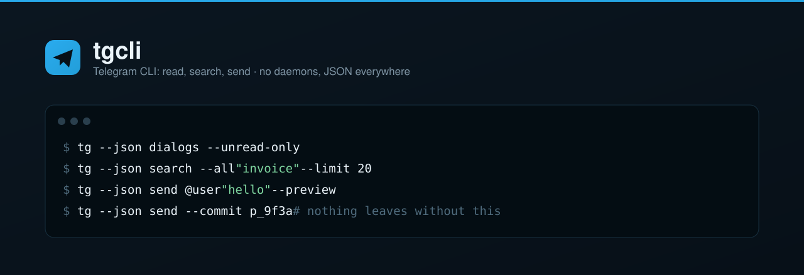
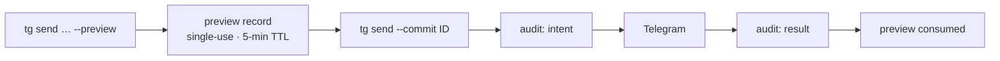

<picture>
  <source media="(prefers-color-scheme: dark)" srcset="docs/assets/readme-banner.svg">
  <source media="(prefers-color-scheme: light)" srcset="docs/assets/readme-banner-light.svg">
  
</picture>

# ✈️ tgcli — Telegram CLI: read, search, send

[](https://github.com/speech115/tgcli/actions/workflows/ci.yml)
[](https://github.com/speech115/tgcli/releases)
[](https://www.python.org/downloads/)
[](docs/decisions/ADR-0071-owner-gated-development.md)
[](LICENSE)

A stateless Telegram client built on [`telethon`](https://github.com/LonamiWebs/Telethon). Signs in as your own user account over MTProto, does exactly one operation per invocation, and gives you JSON-first reading, search, media, export, and preview → commit correspondence from the command line — for humans, scripts, and AI agents alike.

> Third-party tool. Uses the MTProto user API via `telethon`. Not affiliated with Telegram. No daemons, no ports, no LaunchAgents — every command is a foreground process that exits.

Design lineage: [openclaw/gogcli](https://github.com/openclaw/gogcli) (architecture), `tools/telegram` (domain knowledge, sessions, TDLib media experience).

## Contents

[Features](#features) · [Install](#install) · [Quick start](#quick-start) ·
[Documentation](#documentation) · [Configuration](#configuration) ·
[Preview → commit](#preview--commit) · [Status](#status) ·
[Contributing](#contributing) · [License](#license)

## Features

- **Stateless by design** — one entrypoint, one operation per process. Nothing runs between invocations; state is limited to `~/.config/tgcli/` and `~/.local/state/tgcli/`.
- **Automation contract** — `--json` / `--plain` on stdout, everything human on stderr, documented exit codes, additive-only JSON changes. See [docs/CONTRACT.md](docs/CONTRACT.md).
- **Reading and search** — dialogs with unread/kind filters, id- and date-paginated reads, per-dialog and global search, reply threads, message context windows, contacts, mutual chats, and a read-only JSONL batch mode.
- **Safe correspondence** — `send`, `edit`, `delete`, `forward`, and draft writes all go through preview → commit with single-use ids, a 5-minute TTL, operation-specific retry checks, and an append-only audit log.
- **Retry-safe sends and forwards** — `send` and `forward` commits carry a stored Telegram `random_id`, so retrying the same preview confirms the original dispatch instead of creating a duplicate.
- **Media and export** — manifest before download, bulk filtered downloads, JSONL message export with `--resume`, and CSV subscriber export for broadcast channels.
- **Chat clone** — copy broadcast channels, megagroup supergroups (forum and non-forum), legacy basic groups, and private dialogs into tool-created destinations, with native forwards plus protected-content reupload. See [docs/guide/clone.md](docs/guide/clone.md).
- **Daemonless change feed** — `tg changes` returns Telegram updates plus an opaque caller-held cursor, with explicit channel subscriptions, deletion tombstones, and loud gap reporting. See [docs/guide/changes.md](docs/guide/changes.md).
- **Local archive store (Phase 6)** — `tg archive` binds a per-account SQLite store, backfills selected/private dialogs, syncs the changes cursor, acquires bounded voice/video-note media with terminal retry state, transcribes locally with Parakeet, provides filtered/ranked offline search plus timeline/history views, and exposes a bounded one-shot refresh for hourly launchd scheduling. See [docs/guide/archive.md](docs/guide/archive.md) and [docs/guide/archive-refresh.md](docs/guide/archive-refresh.md).
- **Raw TL escape hatch** — `tg api` reaches the long tail of the pinned Telethon layer behind a default-deny read allowlist, an explicit `--write` gate, typed confirmations for destructive verbs, and a permanent denylist.
- **Diagnostics and hygiene** — `tg doctor` reports locally by default (`--connect` for live checks); `tg store stats` / `tg store cleanup` inspect and reclaim local state without ever touching sessions or the audit log.

## Install

`tgcli` requires Python 3.12+ and [`uv`](https://docs.astral.sh/uv/).

Use `tg` (or this checkout's `.venv/bin/python`) for any code that opens a
tgcli session. Do not open `~/.local/state/tgcli/sessions/*.session` with bare
`python3`: a system/user-site Telethon may use an incompatible SQLite session
schema. `tg --json doctor` reports the active runtime under `runtime`.

```bash
git clone https://github.com/speech115/tgcli.git
cd tgcli
uv sync
uv run tg --help
```

### Put `tg` on your PATH

```bash
./scripts/install-link.sh          # symlinks ~/.local/bin/tg -> .venv/bin/tg
```

Override the target with `TGCLI_BIN_DIR=/somewhere/bin`. The script warns if another `tg` already shadows it on your PATH.

### Configure an account

Create `~/.config/tgcli/config.toml` with credentials from [my.telegram.org](https://my.telegram.org):

```toml
default_account = "main"

[accounts.main]
api_id = 123456
api_hash = "0123456789abcdef0123456789abcdef"
session = "main"          # session file name under ~/.local/state/tgcli/
```

Then verify:

```bash
tg --json doctor --connect
```

Existing sessions from the old `tools/telegram` stack can be adopted with `tg accounts import`.

## Quick start

```bash
# 1. What is waiting for me
tg --json dialogs --unread-only

# 2. Read and search
tg --json read @channel --limit 20
tg --json search --all "invoice" --limit 20

# 3. Send — two steps, always
tg --json send @user "hello" --preview     # returns preview_id
tg --json send --commit p_9f3a             # nothing leaves without this

# 4. Media and export
tg --json media download https://t.me/channel/42 --parallel 4
tg --json export messages @channel --output messages.jsonl --resume

# 5. Observe changes — save next_cursor from the first result
tg --json changes --init
tg --json changes --cursor "$CURSOR"

# 6. Health and local state
tg --json doctor
tg --json store stats
```

Chat references accept `@username`, a `t.me/` link, or a numeric dialog id; `tg resolve` additionally takes a phone number in E.164 form. Every command takes `--json` (contract data) or `--plain` (TSV); without either, output is human-readable and unstable by design.

## Documentation

Full guide: **[docs/guide/](docs/guide/README.md)**

| Area | Pages |
| --- | --- |
| **Start** | [overview](docs/guide/overview.md) · [install](docs/guide/install.md) · [quickstart](docs/guide/quickstart.md) · [accounts](docs/guide/accounts.md) |
| **Reading** | [dialogs](docs/guide/dialogs.md) · [read](docs/guide/read.md) · [search](docs/guide/search.md) · [contacts](docs/guide/contacts.md) · [batch](docs/guide/batch.md) · [changes](docs/guide/changes.md) · [archive](docs/guide/archive.md) · [archive refresh](docs/guide/archive-refresh.md) |
| **Writing** | [send](docs/guide/send.md) · [editing](docs/guide/editing.md) · [forward](docs/guide/forward.md) · [drafts](docs/guide/drafts.md) · [formatting](docs/guide/formatting.md) · [inbox](docs/guide/inbox.md) |
| **Data** | [media](docs/guide/media.md) · [export](docs/guide/export.md) · [clone](docs/guide/clone.md) |
| **Operations** | [doctor](docs/guide/doctor.md) · [store](docs/guide/store.md) · [safety](docs/guide/safety.md) · [api](docs/guide/api.md) |
| **Reference** | [CLI contract](docs/CONTRACT.md) · [feature matrix](docs/FEATURES.md) · [ADR index](docs/decisions/README.md) · [changelog](CHANGELOG.md) |
| **Agents** | [SKILL.md](SKILL.md) — routing table and recipes · [AGENTS.md](AGENTS.md) — the contract every agent follows here |

## Configuration

Config lives at `~/.config/tgcli/config.toml`; sessions, locks, previews, the audit log, and cache live under `~/.local/state/tgcli/` (mode `0700`). Account selection order is `--account` > `TGCLI_ACCOUNT` > `default_account`.

**Global flags:** `--account NAME`, `--session-role NAME`, `--json`, `--plain`, `--readonly`, `--timeout SEC` (deadline; governed sleep does not count — see [CONTRACT §1](docs/CONTRACT.md#1-invocation)), `--max-runtime SEC` (wall-clock cap for long runs: normal stop with a resume pointer), `-v/--verbose`, `--version`.

**Environment overrides:**

| Variable | Effect |
| --- | --- |
| `TGCLI_CONFIG` | Config file path. Defaults to `~/.config/tgcli/config.toml`. |
| `TGCLI_STATE_DIR` | State root for sessions, locks, previews, audit log, cache. |
| `TGCLI_ACCOUNT` | Account alias to use when `--account` is absent. |
| `TGCLI_READONLY` | `1` blocks every mutation before any network work. |
| `TGCLI_NO_SEND` | `1` blocks message-producing mutations specifically. |
| `TGCLI_LIVE_SMOKE` | `1` enables the live-account smoke tests in the suite. |

**Exit codes:**

| Code | Meaning |
| --- | --- |
| 0 | success |
| 1 | runtime error |
| 2 | blocked by safety policy |
| 3 | config or authentication error |
| 4 | not found |
| 5 | rate limited; JSON error carries `retry_after` |

## Preview → commit

Reads are free. Preview-backed mutations — `send`, `edit`, `delete`, `forward`, `draft set|clear`, `clone init`, and `clone refresh` — use two invocations. The first resolves and renders the exact intent into a single-use preview record; the second commits that record by id, without retyping it. State-driven direct mutations (`mark-read`, `mark-unread`, every `dialog` subcommand, and `clone sync`) do not mint a preview, but remain gated by `--readonly` / `TGCLI_READONLY`.



```bash
tg --json send @channel "<b>bold</b> and a <tg-spoiler>secret</tg-spoiler>" \
  --format html --preview
# → {"preview_id": "p_9f3a", "to": {…}, "text": "…", "expires_at": "…"}

tg --json send --commit p_9f3a
```

- Previews expire after 5 minutes and are consumed on commit.
- `send`, `edit`, `delete`, `forward`, and draft commits use the retryable preview lifecycle: after a network/runtime failure, retry the same preview id; never create a second preview. `send` and `forward` additionally use their stored Telegram `random_id` for network-level deduplication.
- `clone init` and `clone refresh` consume their preview before dispatch. If either commit fails, create a fresh preview before retrying; already-applied work is recovered or rechecked by the command.
- `--readonly`, `TGCLI_READONLY=1`, and `TGCLI_NO_SEND=1` hard-block mutations with exit 2, before any network call.
- Every committed mutation is appended to the audit log; `tg store cleanup` can never delete it.

## Status

v1.2, in production use and owner-gated (ADR-0071): the project still ships features, but new behavior needs an explicit owner request plus an ADR and a scoped plan, and a bug fix starts from a reproducing test.

CI runs `pytest`, `ruff`, `pyright`, and a fail-closed TL coverage gate on every push and PR ([.github/workflows/ci.yml](.github/workflows/ci.yml)). `scripts/bench.py` is a representative 13-step live smoke benchmark of core read, write, media, and export paths.

## Contributing

The owner gate shapes what lands here: a bug fix starts from a reproducing test, and new behavior needs an owner request plus an ADR before any code. [CONTRIBUTING.md](CONTRIBUTING.md) has the working rules — branch names, the one-command gate, documentation duties — and [AGENTS.md](AGENTS.md) is the full contract every agent follows in this repo. Report a security or privacy issue privately via [SECURITY.md](SECURITY.md); never paste session material or phone numbers into an issue.

## Credits

- Architecture and CLI posture modelled on [`gogcli`](https://github.com/openclaw/gogcli).
- Local-state hygiene and offline diagnostics adopted from a review of [`wacli`](https://wacli.sh) (ADR-0040).
- Built on [`telethon`](https://github.com/LonamiWebs/Telethon) by LonamiWebs.

## Maintainers

- [@speech115](https://github.com/speech115)

## License

[MIT](LICENSE) © speech115. `telethon` ships under its own MIT license; this tool is not affiliated with Telegram.
